## Zharylkassyn Abunassyruly Projects Page

### Printed Circuit Board using Buck Converter **(Spring 2026)**
The Purpose of this project was to design and implement a step-down DC/DC converter utilizing the LT1376 Buck
Converter Integrated Circuit, using Surface Mount Technology (SMT). The project focuses on the 
transition from schematic design to a physical PCB through surface-
mount assembly and design verification. Results demonstrate the
regulator’s efficiency and stability under varying input voltages
and load conditions, with a best-case measured output voltage
of 4.48 V at a 13.00 V input, reflecting a 10.76% deviation from
the theoretical target of 5.02 V.

**METHODS**
A. Mathematical Analysis
To determine the required component values for the feedback
 network, a mathematical model was established based
on the LT1376’s internal reference voltage (Vref ≈ 2.42 V).
The target output voltage was calculated using the standard
non-inverting feedback formula:

*Figure 1.  Equation for converter target output voltage*

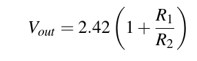

B. Simulation Procedure
Prior to hardware implementation, LTspice and EasyEDA
were used to verify the circuit’s intended functions. 
The simulation procedure involved modeling the switching 
frequency, inductor current ripple, and steady-state output voltage
under various load conditions to ensure the design met the
operational requirements.

C. Component Selection and PCB Design
Components were sourced from Digi-Key, ensuring that all
parts were in stock with sufficient documentation available.
The PCB layout was developed in EasyEDA following the
published PCB guidelines to minimize fabrication complexity.

D. Assembly and Testing
The physical construction involved soldering surface-mount
components (SMT) to the manufactured PCB. The testing
methodology utilized a DC power supply and a digital os
cilloscope to capture the power-up sequence and measure 
performance across a range of input voltages and load resistances.

**RESULTS**
A. Calculated Component Values
Based on the selected values for R1 and R2, a theoretical
target of 5.02 V was established using the equation in Figure 1.

*Figure 2: LTspice simulation results showing regulated output voltage and switching node transients.*

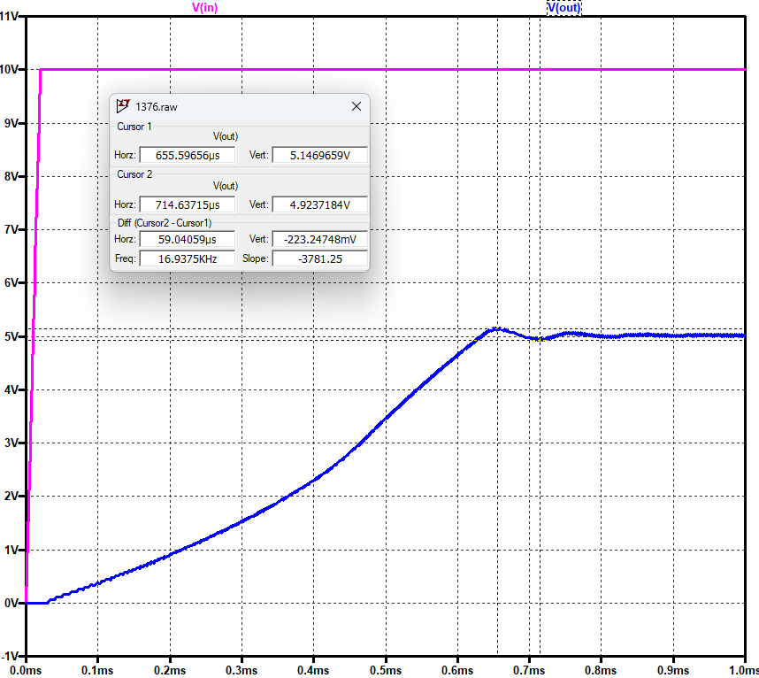

*Figure 3:  EasyEDAnetlist simulation results showing regulated output voltage and switching node transients.*

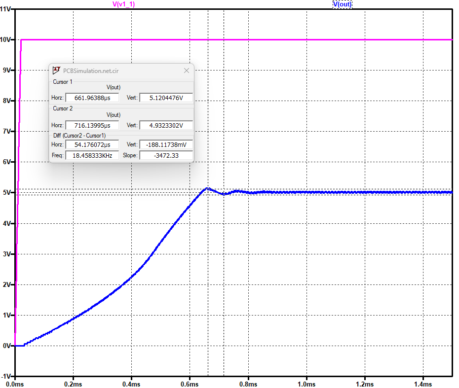

*Figure 4:  Full netlist generated from EasyEDA for the LT1376 circuit design.*

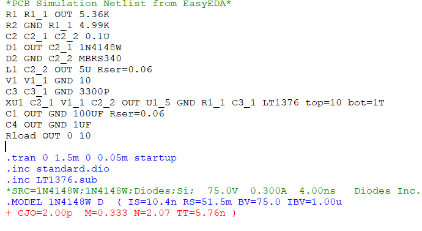

B. Simulation Verification
The simulation produced waveforms validating the feedback
loop’s ability to maintain a regulated output voltage. 
Figure 2 and Figure 3 show the stable output regulation 
across simulation environments. In these ideal models, the output
remained consistently at the 5.02 V target regardless of input
fluctuations above the dropout limit.

*Table I: Project Bill of Materials*

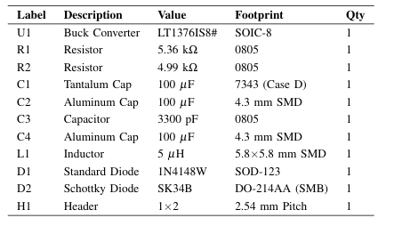

*Figure 5: PCB Layout design showing power traces and ground planes.*

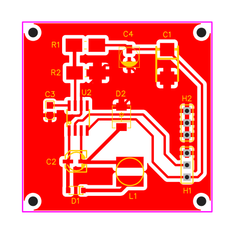

*Figure 6:  Final assembled PCB: Front and Back views*

The final PCB layout and physical views of the completed hardware are shown in Figures 5 and 6.

C.  Performance Data and Analysis
*Figure 7: Oscilloscope capture of the LT1376 power-up waveform showing the
transition to regulated output voltage.*

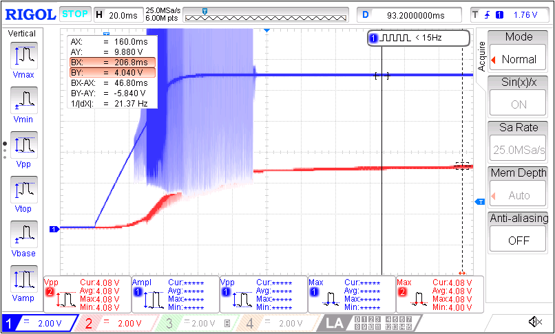

The transient response captured during power-up, shown in
Figure 7 confirmed the LT1376 circuit's startup stability.
However, hardware testing revealed a systematic deviation
from the ideal simulation results.

*Table II: MEASURED OUTPUT VOLTAGE AND PERCENT ERROR *

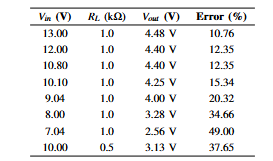

As shown in Table II, the resulting output voltage was
consistently lower than the desired theoretical target. While the
simulation predicted a stable 5.02 V, the maximum measured
output was 4.48 V at a 13.00 V input, representing a 10.76%
error. As the input voltage dropped toward 7.04 V, the error
increased significantly to 49%, indicating the converter had
reached its dropout threshold and could no longer regulate the
output.

**CONCLUSION**

The LT1376-based Buck converter was successfully verified
through simulation and hardware assembly. A comparison
of results highlights the difference between ideal models
and physical implementation. The resulting 10.76% minimum
error in output voltage was likely caused by the wire 
Figure 6 (top) is soldered to the inductor and the LT1376 output. 
This wire was substituted for a trace that was left out during
the PCB design process. Simulations did not account for the
inductance contributed by the wire. Furthermore, the hardware
demonstrated a clear dropout limit at lower input voltages that
was less pronounced in the simulation. Overall, this project
emphasized the importance of considering parasitic effects in
power electronics design to bridge the gap between theoretical
targets and resulting performance.

### Op-Amp PCB Simulation & Hardware Verification **(Fall 2025)

*The schematic from LTSpice*
  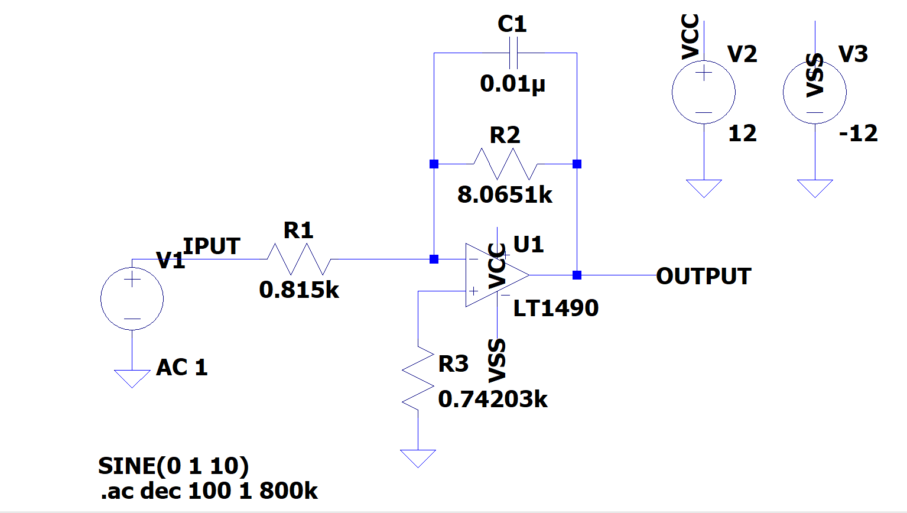

*The schematic from EasyEDA*

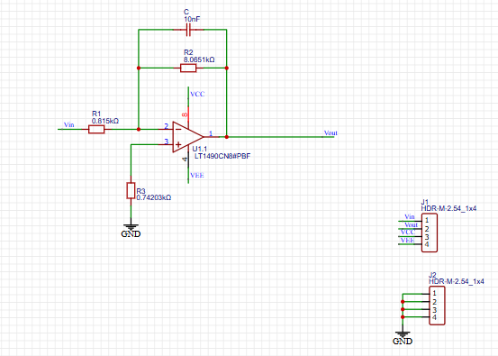

*PCB Layout Design EasyEDA*

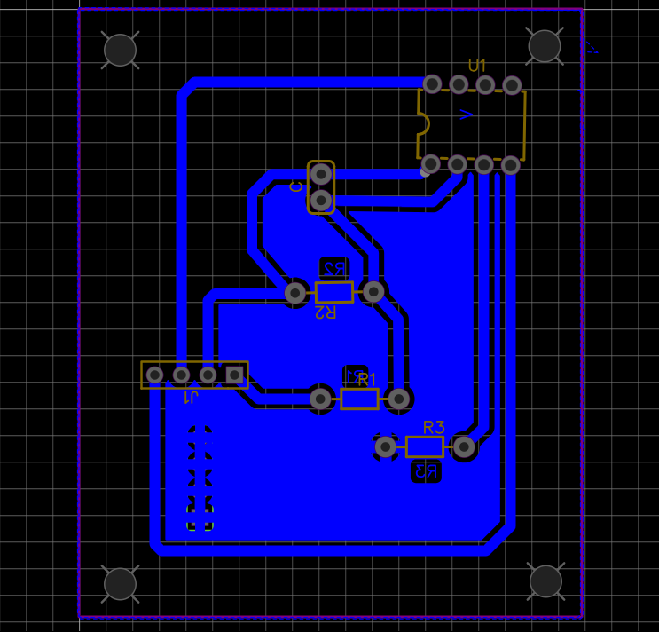

*Physical view of Gerber file from EasyEDA*

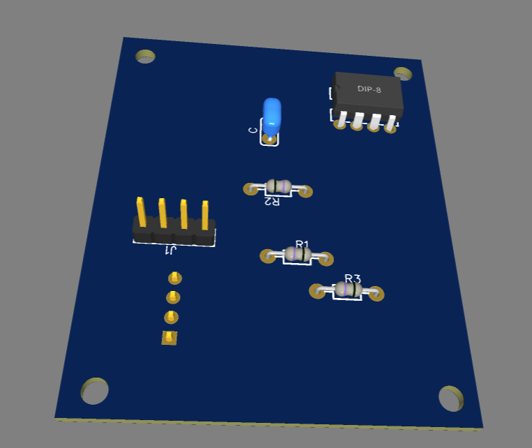

* **Physical Hardware Testing:** Once the PCB was assembled, I set up a lab test using a Rigol oscilloscope. I fed the circuit an input signal with an amplitude of approximately 1V (Vin = ~1.02V).
* **Frequency Sweeping:** I methodically swept the input frequency across 32 distinct intervals, starting at 60 Hz and pushing all the way up to 500 kHz. At each step, I logged the output voltage (Vout) and phase shift to calculate the physical Gain (dB).

*Oscilloscope capture of low-frequency input and output signal.*

*Oscilloscope capture of high-frequency input and output signal.*

*Oscilloscope capture of 500kHZ-frequency input and output signal.*

###  Converting Alphanumeric Codes with Combinational Logic (Spring 2025)

 **METHODS**
* A truth table was constructed for the letters a through z
(lowercase) showing ASCII inputs and EBCDIC outputs, all
in binary form. Then, Boolean expressions were guessed from
the truth table, and the simplification of the Boolean expressions
was performed. Further modification of the expressions was
attempted, relying heavily on DeMorgan’s Theorems, in an
endeavor to reduce the need for INVERTERs and obtain a
system where the final gate was a NOR for each output, which
could combine with an invalidation signal for out-of-range
inputs without needing any additional gates. The result was
implemented in a Quartus Prime .bdf schematic and simulated.

*Table I: Input Definitions*

  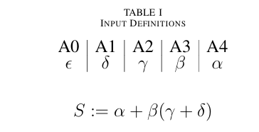
  

*Table II: Outputs as Boolean*

   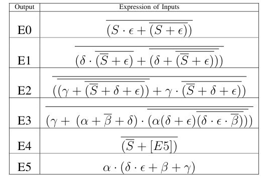

*Logic Circuit Schematic from Intel Quartus Prime*

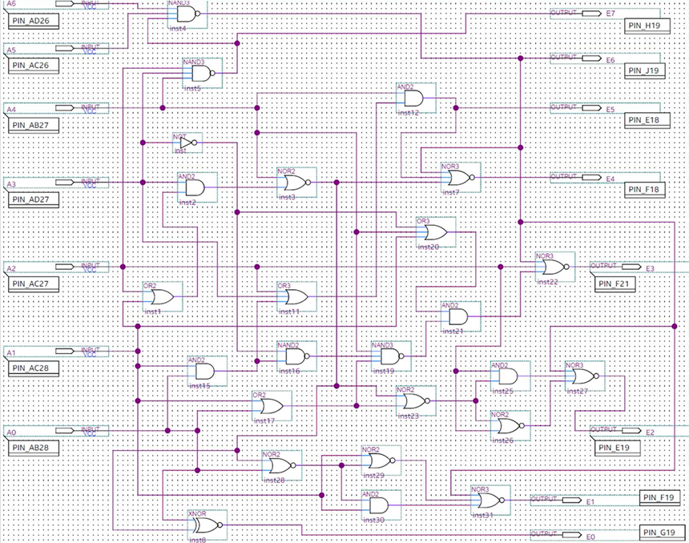

Timing Simulation of Logic Circuit from Intel Quartus Prime 

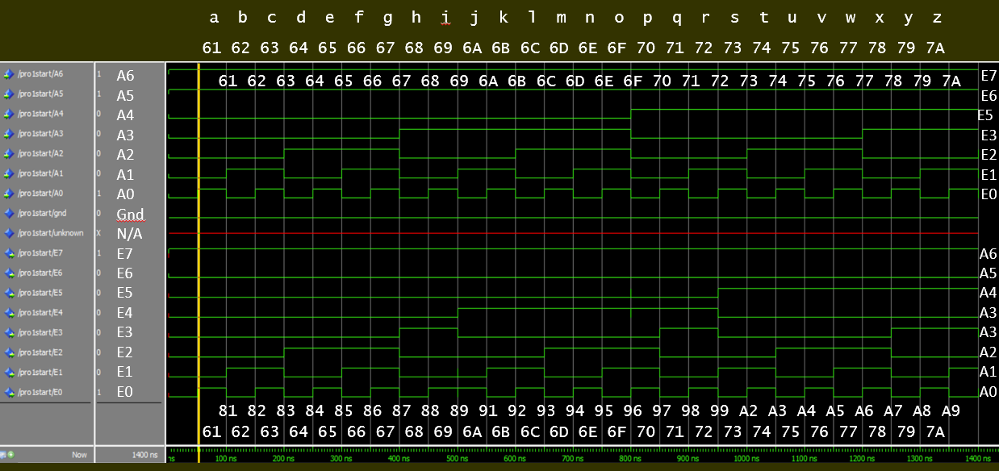

*Functioning of FPGA*

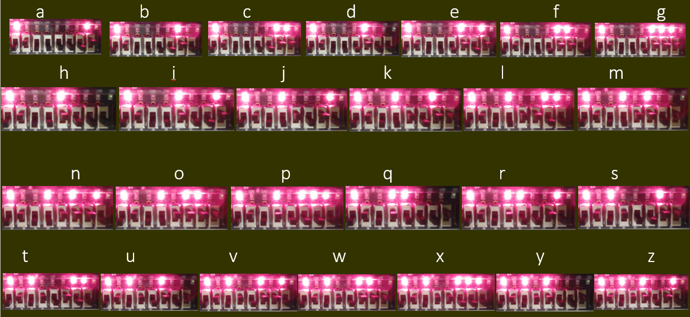

  

